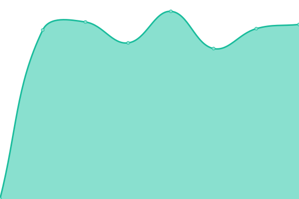

# [📈 Live Status](https://shadedev.github.io/upptime): <!--live status--> **🟩 すべてのシステムは正常に稼働**

This repository contains the open-source uptime monitor and status page for [Shade3D Dev](https://shade3d.jp), powered by [Upptime](https://github.com/upptime/upptime).

With [Upptime](https://upptime.js.org), you can get your own unlimited and free uptime monitor and status page, powered entirely by a GitHub repository. We use [Issues](https://github.com/shadedev/upptime/issues) as incident reports, [Actions](https://github.com/shadedev/upptime/actions) as uptime monitors, and [Pages](https://shadedev.github.io/upptime) for the status page.

<!--start: status pages-->
<!-- This summary is generated by Upptime (https://github.com/upptime/upptime) -->
<!-- Do not edit this manually, your changes will be overwritten -->
<!-- prettier-ignore -->
| URL | 状態 | 履歴 | 応答時間 | 稼働時間 |
| --- | ------ | ------- | ------------- | ------ |
|  [Shade3D](https://shade3d.jp) | 🟩 正常 | [shade3-d.yml](https://github.com/shadedev/upptime/commits/HEAD/history/shade3-d.yml) | 

 1667ミリ秒
     
 | 

<a href="https://status.shade3d.jp/history/shade3-d">100.00%</a>
    

|  [Shade3D Knowledge Base](https://knowledge.shade3d.jp) | 🟩 正常 | [shade3-d-knowledge-base.yml](https://github.com/shadedev/upptime/commits/HEAD/history/shade3-d-knowledge-base.yml) | 

 1001ミリ秒
     
 | 

<a href="https://status.shade3d.jp/history/shade3-d-knowledge-base">100.00%</a>
    

|  [Shade3D Tutorials](https://tutorials.shade3d.jp) | 🟩 正常 | [shade3-d-tutorials.yml](https://github.com/shadedev/upptime/commits/HEAD/history/shade3-d-tutorials.yml) | 

 910ミリ秒
     
 | 

<a href="https://status.shade3d.jp/history/shade3-d-tutorials">100.00%</a>
    

|  [Shade3D Forum](https://forum.shade3d.jp) | 🟩 正常 | [shade3-d-forum.yml](https://github.com/shadedev/upptime/commits/HEAD/history/shade3-d-forum.yml) | 

 1685ミリ秒
     
 | 

<a href="https://status.shade3d.jp/history/shade3-d-forum">100.00%</a>
    

<!--end: status pages-->

[**Visit our status website →**](https://shadedev.github.io/upptime)

## 📄 License

- Powered by: [Upptime](https://github.com/upptime/upptime)
- Code: [MIT](./LICENSE) © [Anand Chowdhary](https://anandchowdhary.com), supported by [Pabio](https://pabio.com)
- Data in the `./history` directory: [Open Database License](https://opendatacommons.org/licenses/odbl/1-0/)
